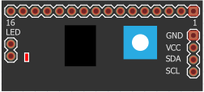
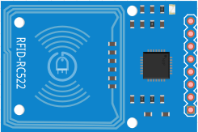
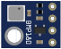
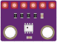
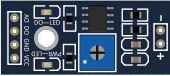
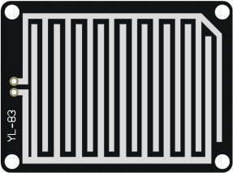
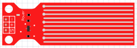

# 🛠 assets fritzing

    Pertama-tama Anda harus menginstall aplikasi Fritzing Designer terlebih dahulu, link download ada di bawah:

- [link alternatif 1 (github) \*non windows](https://github.com/fritzing/fritzing-app/releases)
- [link alternatif 2 (drive)](https://drive.google.com/drive/folders/143UEhZlI20YVZcyeCiVGbbSZ-6VFV0yK?usp=sharing)
- [link alternatif 3 (website resmi)](http://fritzing.org/download/0.8.7b/windows/fritzing.0.8.7b.pc.zip)

## 🌐 Source

### ESP8266 NodeMCU V3 LoLin

https://forum.fritzing.org/t/esp8266-nodemcu-lolin/6386

https://drive.google.com/file/d/1WsjfrpvtWcIlhix8xdx-hG_UWSkQmeIQ/view

https://github.com/OgreTransporter/fritzing-parts-extra

https://github.com/roman-minyaylov/nodemcu-v3-fritzing

### DHT11

https://arduinomodules.info/download/ky-015-temperature-humidity-sensor-module-zip-file/

### LDR

https://github.com/e-radionicacom/e-radionica.com-Fritzing-Library-parts-

### LCM1602 IIC

https://wiki.odroid.com/odroid-h2/application_note/i2c_20x4_lcd

https://github.com/xodio/xod-docs/tree/master/docs/tutorial/108-text-lcd

### RFID RC522

https://github.com/e-radionicacom/e-radionica.com-Fritzing-Library-parts-

### BMP

- 180

http://omnigatherum.ca/wp/?p=6

- 280

http://omnigatherum.ca/wp/?p=338

### Rain Sensor

- Control Board

http://omnigatherum.ca/wp/?p=338

- Detection Board

http://omnigatherum.ca/wp/?p=338

### Water Level Sensor

http://omnigatherum.ca/wp/?p=228

